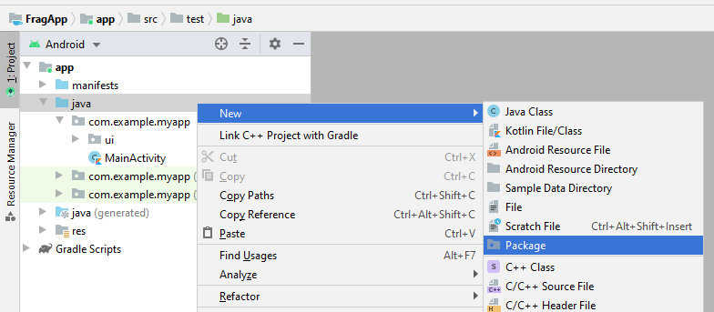
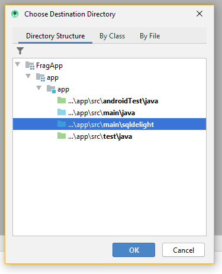
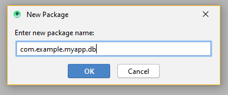
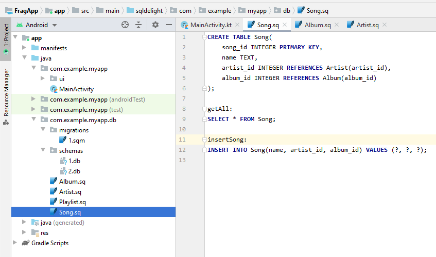

# Android Studio

In Android Studio, it isn't immediately obvious where you can put your SqlDelight source files. You want to right-click the "java" directory with the blue folder icon and press New -> Package

Select the `sqldelight` directory

And create a package to put your SQL files in, like `com.example.myapp.db`:

You then place your SQL definitions and migrations in that package.

It might end up looking something like the below, with your [migrations](https://cashapp.github.io/sqldelight/migrations/) in a `migrations` package, and your schema database files (for verifying your migrations) in a `schemas` package.

